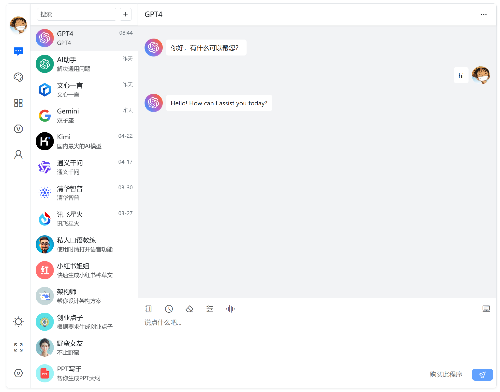
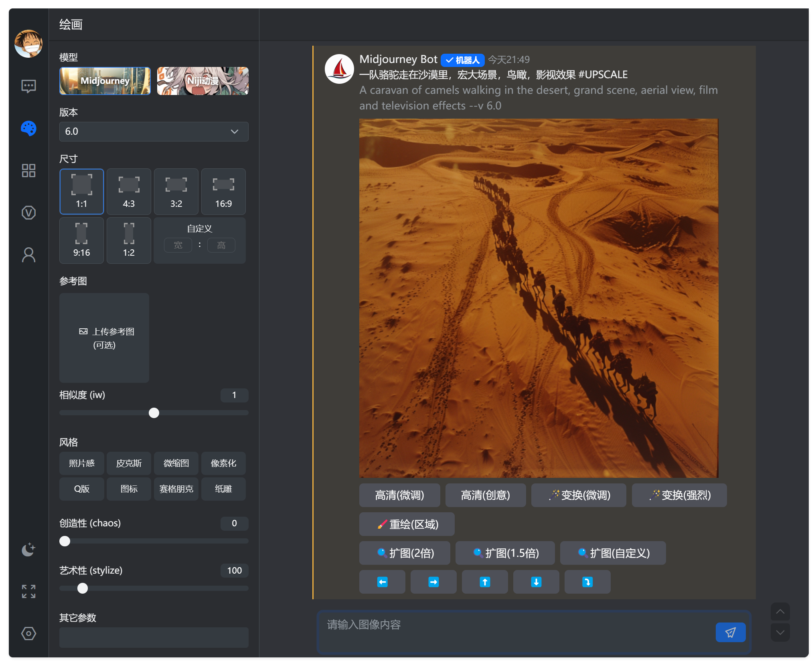

# webman AI
webman/ai是workerman官方开发的一套AI聊天程序，支持多种助手角色。
可以用来聊天、语音对话、识别图片、专业作图、问问题、写代码、写文章、写周报、作诗、翻译等。**并且支持后台知识库，训练自己的模型**。

## 体验地址
https://bla.cn (包含一些付费插件)  
https://www.workerman.net/ai (不包含任何付费插件)  

## 界面截图

## 特色
基于异步非阻塞机制，海量用户访问系统能够始终保持流畅运行。(传统php-fpm架构人多就会明显卡顿)
内置多种角色，每个角色具有不同的功能
支持GPT、Gemini、文心一言、通义千问、讯飞星火、清华智普、kimi、Claude等众多模型
支持完整的Midjourney作图功能，包括选图、变换、垫图、融合、局部重绘、扩图等功能
支持训练(知识库)
支持语音聊天
支持识图功能
支持连续对话
支持历史对话切换
支持Dall.E画图功能
支持上创造性、最大tokens、下文、模型等参数设置
支持会员功能
支持订单功能
支持应用市场
支持敏感词过滤
支持黑名单
支持明亮/暗黑模式
支持H5手机访问
还有更多插件正在开发之中

## 购买链接
[webman AI](https://www.workerman.net/app/view/ai)
