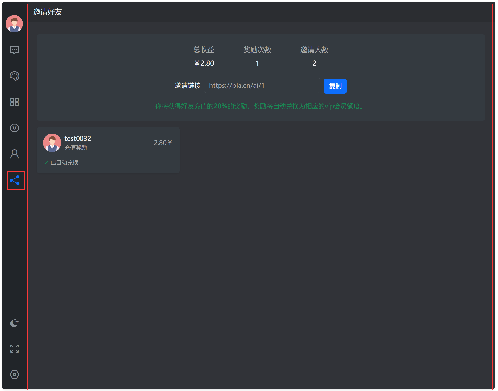
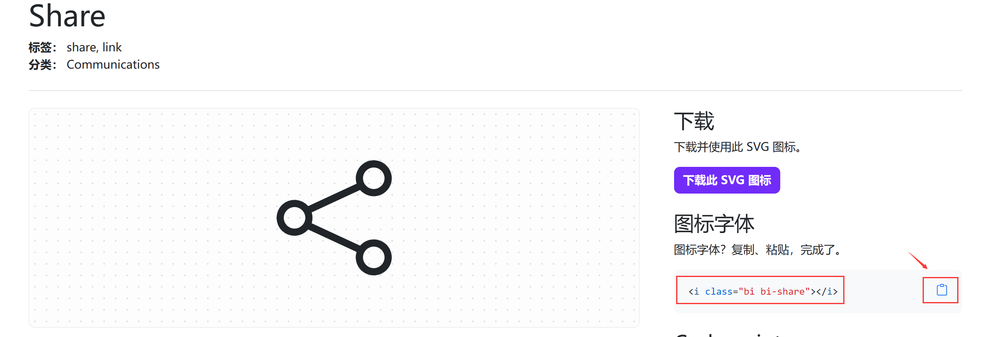
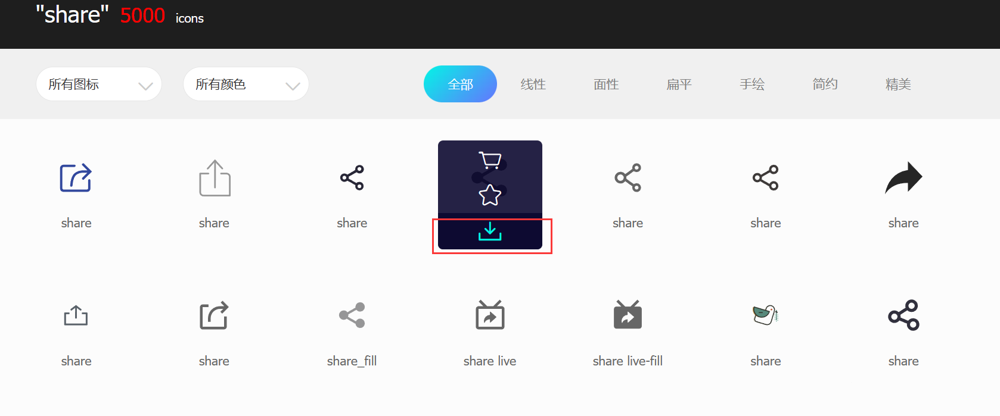
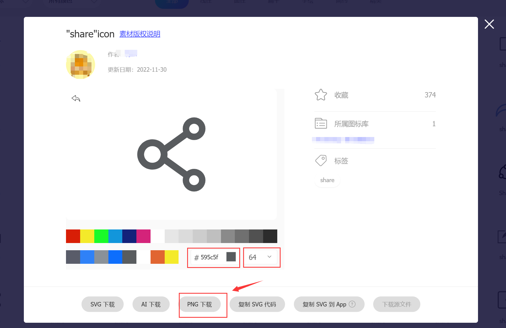

# 添加图标菜单


如图所示，左边每个图标代表一个功能模块，点击左边图标右边窗体会以iframe的方式加载图标对应的url内容。

## 菜单事件
菜单渲染有一个`ai.menu.list`事件，如果需要添加菜单，参考以下步骤

> **提示**
> 有关事件的更多信息，请参阅[webman event事件](https://www.workerman.net/doc/webman/components/event.html)

创建 `plugin/foo/config/event.php` 内容如下。（也可以配置`config/event.php`）
```php
<?php

use plugin\ai\app\event\data\EventData;

return [
    // 渲染左侧图标菜单时触发
    'ai.menu.list' => [
        function (EventData $object) {
            $data = $object->data;
            $data['invite'] = [
                'enabled' => true, // 是否启用
                'title' => '邀请好友', // 标题
                'icon' => [
                    'light' => '<i class="bi bi-share"></i>', // 明亮主题下的图标
                    'dark' => '<i class="bi bi-share"></i>',  // 暗黑主题下的图标
                    'active' => '<i class="bi bi-share-fill"></i>' // 被选中后的图标
                ],
                'url' => '/app/foo', // iframe url 地址
                'mobile' => true, // 是否在移动端显示图标菜单
            ];
            $object->data = $data;
        }
    ]
];
```

以上配置含义是定义了一个invite为key的邀请菜单，icon定义了各个状态下的图标样式，点击这个图标右侧窗体会以iframe形式加载`url`字段指定的页面内容。

## 图标
图标默认使用的是bootstrap的图标，地址为 https://icons.bootcss.com/ ，选择喜欢的图标点击后点击复制按钮粘贴到`light` `dark` `active`的字段上。



## 其它图标
如果 https://icons.bootcss.com/ 没有你喜欢的图标，你也可以使用自己的图片代替，例如到 https://www.iconfont.cn/ 寻找下载png格式的图片，放到 `plugin/foo/public/img` 下，然后在`icon`字段中填写``标签。




注意需要下载3个图片，颜色分别为light黑灰色#595c5f，dark灰色#8a9198，active蓝色#007bff。图标大小最小64px，太小会模糊。

例如 `plugin\foo\public\img` 下载了三个图标如下


`ai.menu.list` 配置如下
```php
'ai.menu.list' => [
    function (EventData $object) {
        $data = $object->data;
        $data['invite'] = [
            'enabled' => true,
            'title' => '邀请好友',
            'icon' => [
                'light' => '',
                'dark' => '',
                'active' => ''
            ],
            'url' => '/app/foo',
            'mobile' => true,
        ];
        $object->data = $data;
    }
]
```
