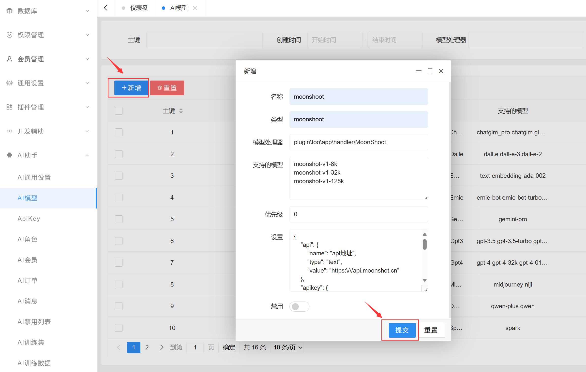
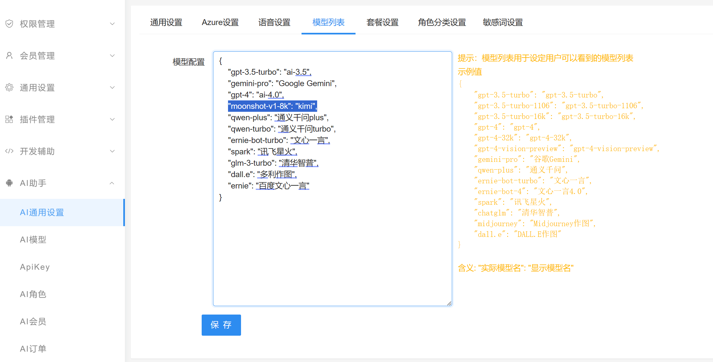
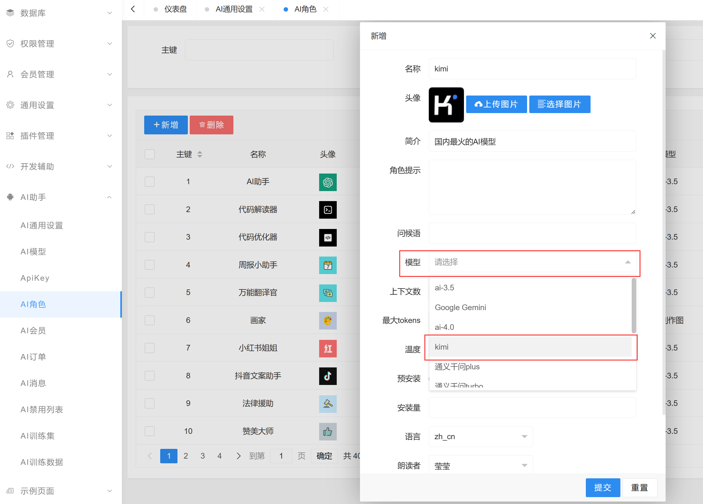
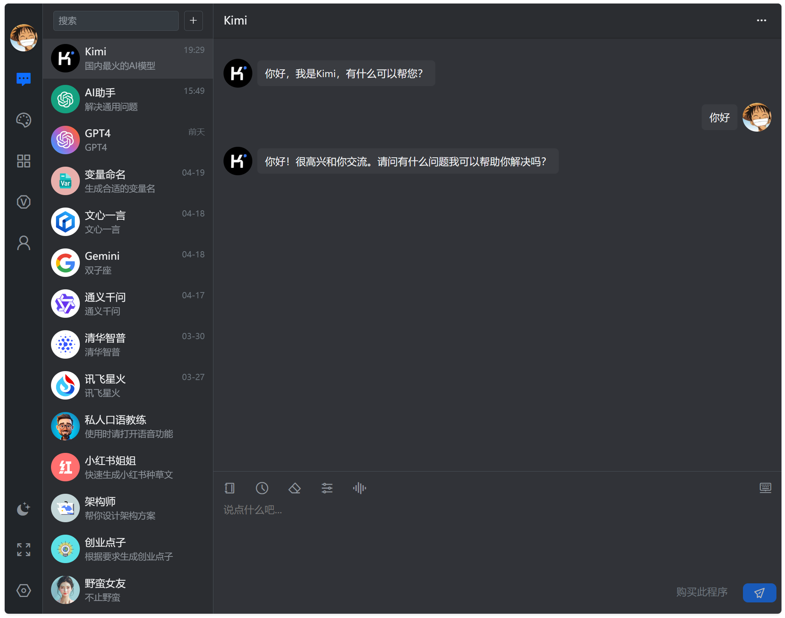

# 添加大模型

大模型是指机器学习模型，例如最出名的openai的gpt-3.5 gpt-4等。
webman ai支持常见的大模型包括openai的 gpt-3.5 gpt-4、百度文心一言、讯飞星火、阿里通义千问、清华智普、谷歌Gemini、Claude等模型。

如果需要接入其它模型，请参考以下文档。

> **提示**
> 根据二开必读的说明，后续示例二开代码将放到新建应用插件目录，你也可以选择放到本地主项目目录，代码结构是一样的，只不过命名空间不同，后面不再赘述。

# 添加 moonshot kimi模型
文档 https://platform.moonshot.cn/docs/api-reference

## 创建应用插件

**创建插件**
执行命令
```shell
php webman app-plugin:create foo
```

## 创建所需要的类

**plugin/foo/app/handler/MoonShoot.php**
```php
<?php

namespace plugin\foo\app\handler;

use plugin\ai\app\handler\Base;
use plugin\ai\app\handler\driver\Gpt3;

class MoonShoot extends Base
{
    /**
     * @var string 模型处理器名称
     */
    protected static $name = 'moonshoot';

    /**
     * @var string 模型类型
     */
    protected static $type = 'moonshoot';

    /**
     * @var string 处理器
     */
    protected $driverClass = Gpt3::class;

    /**
     * 对话
     * @param $data
     * @param $options
     * @return void
     */
    public function completions($data, $options)
    {
        $this->driver = new $this->driverClass($this->getSettings());
        $this->driver->completions($data, $options);
    }

}
```

> **提示**
> 因为moonshoot模型的接口与gpt接口参数及返回是一致的，所以这里driver直接使用gpt3的处理器，如果与gpt接口不一致，需要自行实现driver类整理请求参数和返回数据，具体可以参考plugin/ai/app/handler/driver下的类。

## 管理后台添加模型

进入管理和后台AI模型管理页面，添加模型


* 名称：`moonshoot`  
* 类型：`moonshoot`  
* 处理器：`plugin\foo\app\handler\MoonShoot`  
* 支持的模型：
```
moonshot-v1-8k
moonshot-v1-32k
moonshot-v1-128k
```
* 优先级：0  
* 设置：
```json
{
    "api": {
        "name": "api地址",
        "type": "text",
        "value": "https:\/\/api.moonshot.cn"
    },
    "apikey": {
        "name": "ApiKey",
        "type": "text",
        "value": "<这里填写moonshot的apikey，sk-开头的字符串>",
        "desc": "这里填写ApiKey"
    },
    "regFreeCount": {
        "name": "注册赠送",
        "type": "number",
        "value": "100"
    },
    "dayFreeCount": {
        "name": "每日赠送",
        "type": "number",
        "value": "100"
    }
}
```
保存

## 设置AI模型列表
现在webman ai内部已经拥有处理moonshoot的模型的能力了，接下来需要将moonshoot模型暴露出来，让用户可以选择使用。
如图模型列表里添加对外暴露的模型及别名，这里只暴露了`moonshot-v1-8k`并起了别名`kimi`，你也可以将 `moonshot-v1-32k` `moonshot-v1-128k` 都暴露出来，别名例如`kimi-32k` `kimi-128k`。


## 添加AI角色
在AI角色管理页面添加一个角色，选择刚刚暴露的`kimi`模型，保存，这样用户就能看到kimi角色了。



