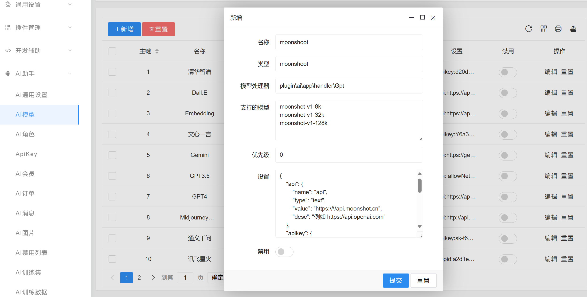

# 添加大模型

大模型是指机器学习模型，例如最出名的openai的gpt-3.5 gpt-4等。
webman ai支持常见的大模型包括openai的 gpt-3.5 gpt-4、百度文心一言、讯飞星火、阿里通义千问、清华智普、谷歌Gemini、Claude等模型。

如果需要接入其它模型，请参考以下文档。

## 管理后台添加模型

假设我们要添加moonshoot模型，进入管理和后台AI模型管理页面，添加模型


* 名称：`moonshoot`  
* 类型：`moonshoot`  
* 处理器：`plugin\ai\app\handler\Gpt`  
* 支持的模型：
```
moonshot-v1-8k
moonshot-v1-32k
moonshot-v1-128k
```
* 优先级：0  
* 设置：
```json
{
    "api": {
        "name": "api地址",
        "type": "text",
        "value": "https:\/\/api.moonshot.cn",
        "desc": "例如 https://api.openai.com"
    },
    "apikey": {
        "name": "ApiKey",
        "type": "text",
        "value": "<这里填写moonshot的apikey，sk-开头的字符串>",
        "desc": "这里填写ApiKey"
    },
    "regFreeCount": {
        "name": "注册赠送",
        "type": "number",
        "value": "100"
    },
    "dayFreeCount": {
        "name": "每日赠送",
        "type": "number",
        "value": "100"
    }
}
```
保存

> **注意**
> 因为moonshoot的接口支持GPT格式，所以这里的处理器是`plugin\ai\app\handler\Gpt`，如果是其它模型，处理器可能不同。

## 设置AI模型列表
现在webman ai内部已经拥有处理moonshoot的模型的能力了，接下来需要将moonshoot模型暴露出来，让用户可以选择使用。
如图模型列表里添加对外暴露的模型及别名，这里只暴露了`moonshot-v1-8k`并起了别名`kimi`，你也可以将 `moonshot-v1-32k` `moonshot-v1-128k` 都暴露出来，别名例如`kimi-32k` `kimi-128k`。


## 添加AI角色
在AI角色管理页面添加一个角色，选择刚刚暴露的`kimi`模型，保存，这样用户就能看到kimi角色了。


