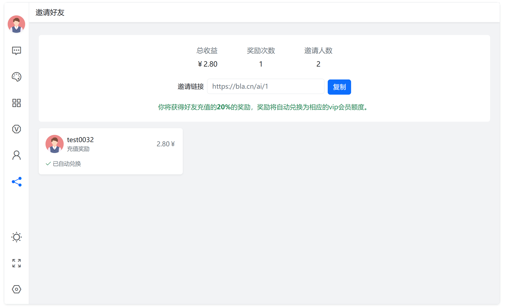
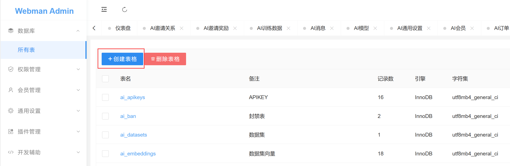
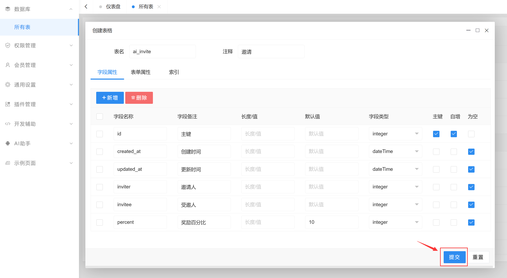
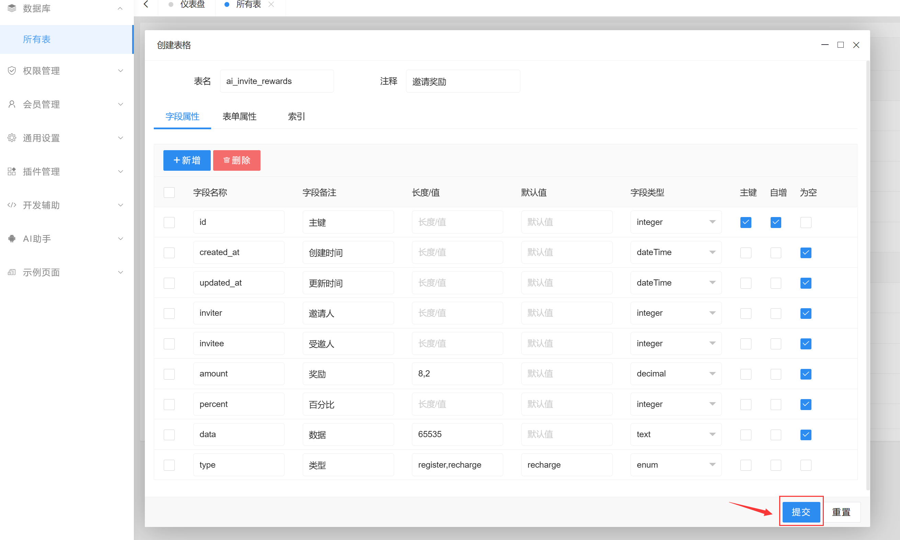
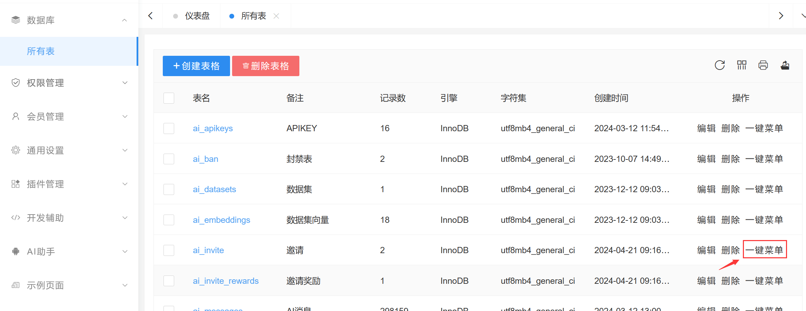
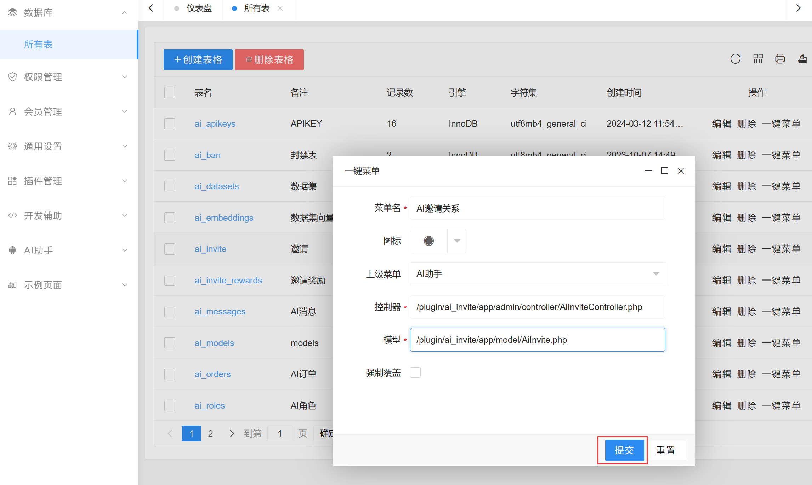
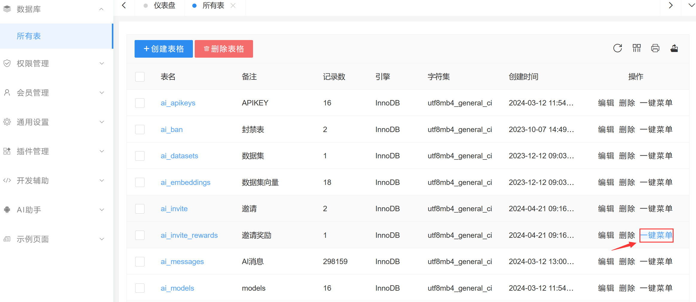
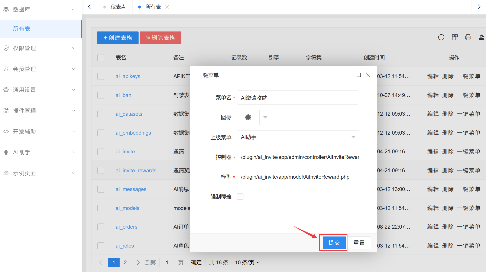
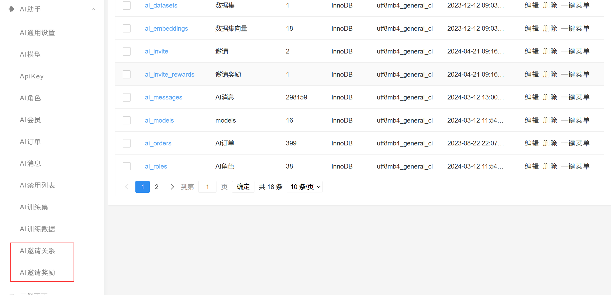
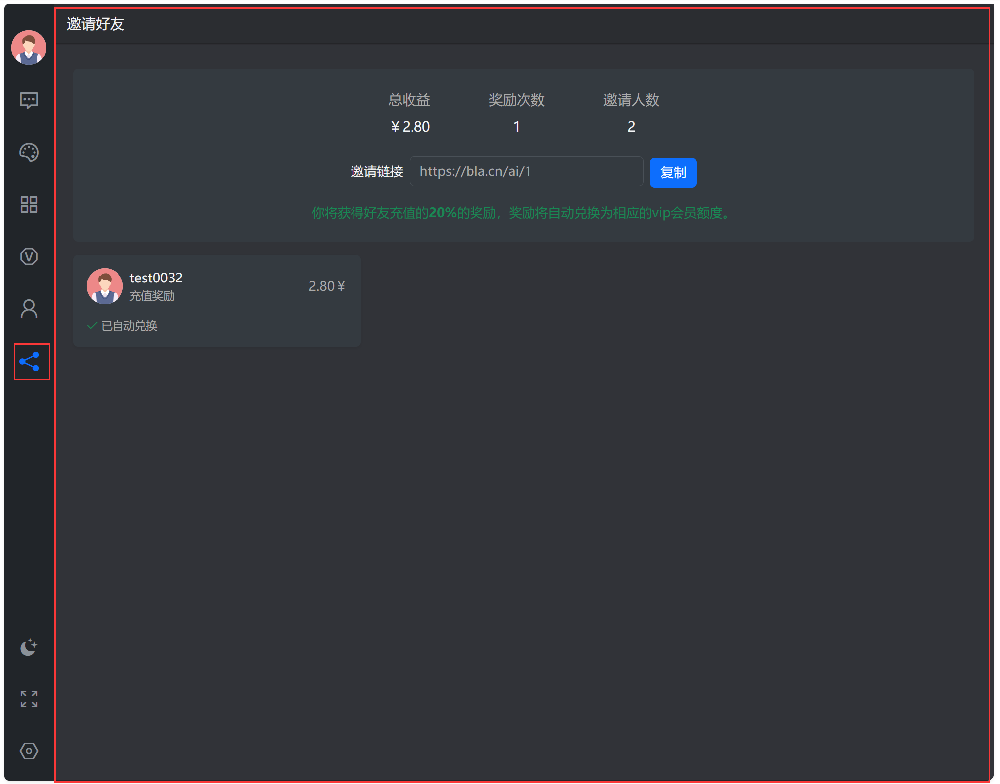

# 添加功能模块


接下来我们将介绍如何添加如图所示的邀请功能模块。

## 邀请功能介绍及原理
* 每个注册用户有一个邀请链接，链接中包含了邀请人的user_id，例如 https://bla.cn/ai/101
* 受邀者访问这个链接时系统会记录一个cookie ai_inviter=邀请人user_id
* 受邀者注册时读取这个cookie，将邀请人和被邀请人记录到 ai_invite 表
* 被邀请人购买会员时邀请人获得奖励，奖励记录到 ai_invite_rewards 表

> **注意**
> 为了避免和其插件表名冲突，AI系统相关的表格一律以ai_开头

## 创建项目
```shell
 php webman app-plugin:create ai_invite
```

## 建表






## 一键菜单生成后台

给新建的两个表分别生成菜单

#### ai_inviteb表



控制器 `/plugin/ai_invite/app/admin/controller/AiInviteController.php`  
模型 `/plugin/ai_invite/app/model/AiInvite.php`

#### ai_invite_rewards表



控制器 `/plugin/ai_invite/app/admin/controller/AiInviteRewardController.php`
模型 `/plugin/ai_invite/app/model/AiInviteReward.php`

#### 生成结果
刷新后能看到生成的菜单如下


以上操作会生成两个模型`AiInvite` `AiInviteReward`，开发者可以在后续代码中直接使用。

## 邀请链接设计及实现
邀请链接类似 http://bla.cn/ai/101 ，其中101是邀请人的用户ID，进入这个链接后实际上就是显示AI的主页(用户不会感到任何区别)，但是会记录一个cookie ai_inviter，值为101。
为了不入侵现有AI系统代码，我们需要使用中间件来做这个事情。

新建中间件 `plugin/ai_invite/app/middleware/Invite.php` 内容如下
```php
<?php
namespace plugin\ai_invite\app\middleware;

use Webman\MiddlewareInterface;
use Webman\Http\Response;
use Webman\Http\Request;

class Invite implements MiddlewareInterface
{
    public function process(Request $request, callable $handler) : Response
    {
        $response = $handler($request);
        if ($request->route && $aiInviter = $request->route->param('ai_inviter')) {
            if (!$request->cookie('ai_inviter')) {
                $response->cookie('ai_inviter', $aiInviter, 3600 * 24 * 365, '/');
            }
        }
        return $response;
    }
}
```

打开 `plugin/ai_invite/config/route.php` 添加以下路由
```php
<?php

use plugin\ai_invite\app\middleware\Invite;
use plugin\ai\app\controller\IndexController;
use Webman\Route;

Route::any('/ai/{ai_inviter:\d+}', [IndexController::class, 'index'])->middleware(Invite::class);
```

这样当访问 `http://bla.cn/ai/101` 时会记录一个cookie ai_inviter，值为101。

## 通过事件系统实现相关功能
系统有新用户注册时会触发一个`user.register`事件，用户购买会员时会触发一个`ai.payment.success`事件，左侧图标菜单渲染事件为`ai.menu.list`，我们可以通过监听这些事件来实现对应的功能，并且不会入侵现有AI系统源码。
如果你想要了解系统的其它事件请参考 [事件列表](event-list.md)

创建 `plugin/ai_invite/config/event.php` 内容如下
```php
<?php

use plugin\ai\app\event\data\EventData;
use plugin\ai\app\model\AiModel;
use plugin\ai_invite\app\model\AiInvite;
use plugin\ai_invite\app\model\AiInviteReward;
use plugin\ai_invite\app\service\Invite;
use plugin\user\app\model\User;
use plugin\ai\api\User as ApiUser;

return [
    // 用户注册时触发
    'user.register' => [
        function (User $user) {
            $request = request();
            if (!$request) {
                return;
            }
            $inviter = $request->cookie('ai_inviter');
            if ($inviter && is_numeric($inviter) && User::find($inviter)) {
                $aiInvite = new AiInvite();
                $aiInvite->inviter = $inviter;
                $aiInvite->invitee = $user->id;
                $aiInvite->percent = Invite::getSetting()['percent'] ?? 10;
                $aiInvite->save();
            }
        }
    ],
    // 在ai系统支付时触发
    'ai.payment.success' => [
        function ($paymentData) {
            $userId = $paymentData->userId;
            $data = $paymentData->data;
            $aiInvite = AiInvite::where('invitee', $userId)->first();
            if (!$aiInvite) {
                return;
            }
            $percent = 0.1;
            $inviter = $aiInvite->inviter;
            $reward = new AiInviteReward;
            $reward->inviter = $inviter;
            $reward->invitee = $userId;
            $reward->percent = $percent;
            $reward->data = json_encode($data);
            $reward->amount = round($data['price'] * $percent, 2);
            $reward->type = 'recharge';
            $reward->save();
            // 自动给邀请人增加余额
            $modelTypes = AiModel::pluck('type')->toArray();
            $data['days'] = isset($data['months']) ? $data['months'] * 30 : $data['days'];
            $data['days'] = ceil($data['days'] * $percent);
            unset($data['months']);
            foreach ($data as $key => $value) {
                if (in_array($key, $modelTypes)) {
                    $data[$key] = ceil($value * $percent);
                }
            }
            ApiUser::addBalanceByPlanData($inviter, $data);
        }
    ],
    // 渲染左侧图标菜单时触发
    'ai.menu.list' => [
        function (EventData $object) {
            $data = $object->data;
            $data['invite'] = [
                'enabled' => true, // 是否启用
                'title' => '邀请好友', // 标题
                'icon' => [
                    'light' => '<i class="bi bi-share"></i>', // 明亮主题下的图标
                    'dark' => '<i class="bi bi-share"></i>',  // 暗黑主题下的图标
                    'active' => '<i class="bi bi-share-fill"></i>' // 被选中后的图标
                ],
                'url' => '/app/ai_invite', // iframe url 地址
                'mobile' => true, // 是否在移动端显示图标菜单
            ];
            $object->data = $data;
        }
    ]
];
```


## 开发 /app/ai_invite 页面

`plugin/ai_invite/app/controller/IndexController.php` 控制器内容如下

```php
<?php

namespace plugin\ai_invite\app\controller;

use plugin\ai_invite\app\model\AiInvite;
use plugin\ai_invite\app\model\AiInviteReward;
use plugin\ai_invite\app\service\Invite;
use plugin\user\api\User;
use support\Request;

class IndexController
{
    // 首页
    public function index(Request $request)
    {
        if (!session('user')) {
            return redirect('/app/ai/user/login?redirect=' . urlencode($request->uri()));
        }
        $userId = session('user.uid') ?? session('user.id');
        $totalAmount = AiInviteReward::where('inviter', $userId)->sum('amount');
        $totalRewords = AiInviteReward::where('inviter', $userId)->count();
        $totalInvitees = AiInvite::where('inviter', $userId)->count('invitee');
        return view('index/index', [
            'totalAmount' => $totalAmount,
            'totalRewords' => $totalRewords,
            'totalInvitees' => $totalInvitees,
        ]);
    }

    // 加载邀请奖励数据
    public function invitees()
    {
        $userId = session('user.uid') ?? session('user.id');
        $items = AiInviteReward::where('inviter', $userId)->orderBy('id')->get();
        $userIdArray = array_unique($items->pluck('invitee')->toArray());
        $users = User::whereIn('id', $userIdArray)->get()->keyBy('id');
        $data = [];
        $typeMap = [
            'recharge' => '充值奖励',
            'register' => '注册奖励',
        ];
        foreach ($items as $item) {
            $user = $users[$item->invitee];
            $data[] = [
                'id' => $user->id,
                'nickname' => $user->nickname,
                'avatar' => $user->avatar,
                'amount' => $item->amount,
                'created_at' => $item->created_at,
                'type' => $typeMap[$item->type],
            ];
        }
        return json([
            'code' => 0,
            'msg' => 'ok',
            'data' => $data,
        ]);
    }

}


```

`plugin/ai_invite/app/view/index/index.html` 页面内容如下
```html
<!doctype html>
<html lang="zh-cn">
<head>
    <meta charset="utf-8">
    <meta name="viewport" content="width=device-width, initial-scale=1.0, maximum-scale=1.0">
    <link rel="shortcut icon" href="/favicon.ico" />
    <link href="/app/ai/css/bootstrap.min.css?v=5.3" rel="stylesheet">
    <link href="/app/ai/css/app.css?v=<?=$css_version??1?>" rel="stylesheet">
    <script src="/app/ai/js/jquery.min.js"></script>
    <script src="/app/ai/js/bootstrap.bundle.min.js?v=5.3"></script>
    <title>webman AI - 邀请</title>
</head>

<body data-bs-theme="light">

<div class="header">邀请好友</div>
<div class="container-fluid p-4 overflow-scroll" style="height: calc(100% - 45px)">
    <div class="row">
        <div class="col-12 pt-2" id="app">
            <div class="rounded white-bg py-4 px-3">
                <div class="d-flex justify-content-center">
                    <div class="d-flex justify-content-around f16" style="max-width:400px; min-width: 380px;">
                        <div class="d-flex flex-column justify-content-center align-items-center">
                            <div class="text-secondary mb-2">总收益</div>
                            <div>￥<?=$totalAmount?></div>
                        </div>
                        <div class="d-flex flex-column justify-content-center align-items-center">
                            <div class="text-secondary mb-2">奖励次数</div>
                            <div><?=$totalRewords?></div>
                        </div>
                        <div class="d-flex flex-column justify-content-center align-items-center">
                            <div class="text-secondary mb-2">邀请人数</div>
                            <div><?=$totalInvitees?></div>
                        </div>
                    </div>
                </div>

                <div class="d-flex flex-column align-items-center justify-content-center mt-4">
                    <div>
                        <span class="me-2">邀请链接</span>
                        <input ref="inputElement" class="form-control me-2 d-inline-block border text-secondary mb-1" type="text" v-model="inviteUrl" readonly style="width:18em">
                        <button class="btn btn-primary" @click="copyToClipboard">复制</button>
                    </div>
                    <div class="mt-3 text-success">
                        你将获得好友充值的<b>10%</b>的奖励，奖励将自动兑换为相应的vip会员额度。
                    </div>
                </div>

            </div>

            <div class="row" v-cloak>
                <div v-for="invitee in invitees" class="col-12 col-sm-6 col-md-6 col-lg-4 col-xl-3">
                    <div class="white-bg shadow-sm mt-3 rounded p-3">
                        <div class="d-flex align-items-center justify-content-between role position-relative">
                            <div class="d-flex align-items-center">
                                
                                <div>
                                    <div>{{invitee.nickname}}</div>
                                    <div class="text-secondary-sm">{{invitee.type}}</div>
                                </div>
                            </div>
                            <div class="text-secondary">
                                {{invitee.amount}}￥
                            </div>
                        </div>
                        <div class="mt-3 d-flex justify-content-between align-items-center">
                            <span class="text-secondary-sm">已自动兑换</span>
                        </div>
                    </div>
                </div>
            </div>
        </div>
    </div>
</div>

<!-- vue -->
<script type="text/javascript" src="/app/ai/js/vue.global.js"></script>

<script>
    const App = {
        data() {
            return {
                invitees: [],
                inviteUrl: '',
            }
        },
        mounted() {
            this.loadInvitees();
            this.inviteUrl = location.origin + '/ai/' + window.parent.ai.loginUser.userid;
        },
        methods: {
            copyToClipboard() {
                const inputElement = this.$refs.inputElement;
                const item = new ClipboardItem({ 'text/plain': new Blob([inputElement.value], { type: 'text/plain' }) });
                navigator.clipboard.write([item]).then(() => {
                    webman.success('复制成功');
                }).catch((error) => {
                    console.error('复制失败', error);
                });
            },
            loadInvitees() {
                $.ajax({
                    url: "/app/ai_invite/index/invitees",
                    success: (res) => {
                        if (res.code) {
                            return alert(res.msg);
                        }
                        this.invitees = res.data;
                    }
                });
            }
        }
    }
    Vue.createApp(App).mount('#app');

</script>

<script src="/app/user/js/webman.js"></script>

</body>
</html>
```

## 最终效果类似如下


## install.sql
如果你想发布插件给其他人使用，需要在插件目录下创建一个`install.sql`文件，这个文件会在插件安装时执行，用来初始化数据库表结构。
plugin/ai_invite/install.sql
```sql
CREATE TABLE `ai_invite` (
 `id` int NOT NULL AUTO_INCREMENT COMMENT '主键',
 `created_at` datetime DEFAULT NULL COMMENT '创建时间',
 `updated_at` datetime DEFAULT NULL COMMENT '更新时间',
 `inviter` int DEFAULT NULL COMMENT '邀请人',
 `invitee` int DEFAULT NULL COMMENT '受邀人',
 `percent` int DEFAULT '10' COMMENT '奖励百分比',
 PRIMARY KEY (`id`),
 UNIQUE KEY `invitee` (`invitee`),
 KEY `inviter` (`inviter`)
) ENGINE=InnoDB DEFAULT CHARSET=utf8mb4 COLLATE=utf8mb4_general_ci COMMENT='邀请';

CREATE TABLE `ai_invite_rewards` (
 `id` int NOT NULL AUTO_INCREMENT COMMENT '主键',
 `created_at` datetime DEFAULT NULL COMMENT '创建时间',
 `updated_at` datetime DEFAULT NULL COMMENT '更新时间',
 `inviter` int DEFAULT NULL COMMENT '邀请人',
 `invitee` int DEFAULT NULL COMMENT '受邀人',
 `amount` decimal(8,2) DEFAULT NULL COMMENT '奖励',
 `percent` int DEFAULT NULL COMMENT '百分比',
 `data` text COLLATE utf8mb4_general_ci COMMENT '数据',
 `type` enum('register','recharge') COLLATE utf8mb4_general_ci NOT NULL DEFAULT 'recharge' COMMENT '类型',
 PRIMARY KEY (`id`),
 KEY `inviter` (`inviter`),
 KEY `invitee` (`invitee`)
) ENGINE=InnoDB DEFAULT CHARSET=utf8mb4 COLLATE=utf8mb4_general_ci COMMENT='邀请奖励';
```

> **注意**
> 每个语句以;结束

> **特别注意**
> 如果你的插件后续版本需要修改表结构，只能通过追加的方式将alter table语句放再install.sql末尾，千万不要直接修改建表语句，否则老用户无法实现升级。
> 这部分的说明参考 [webman应用插件自动导入数据库](https://www.workerman.net/doc/webman/app/database.html#%E8%87%AA%E5%8A%A8%E5%AF%BC%E5%85%A5%E6%95%B0%E6%8D%AE%E5%BA%93)

## 发布插件并获取收益
参考 [发布插件](../app-plugin-market.md)