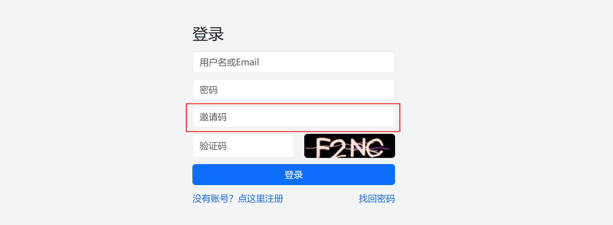

# 修改页面

有时候我们要修改页面内容或者样式，这种情况下我们可以通过中间件或者路由覆盖的方式来实现。

## 中间件更改页面内容
假设我们需要给登录页面添加一个邀请码输入框


#### 创建插件foo
如果已经创建则忽略
```shell
php webman app-plugin:create foo
```

#### 创建中间件
`plugin/foo/app/middleware/InviteCode.php`
```php
<?php
namespace plugin\foo\app\middleware;

use Webman\Http\Request;
use Webman\Http\Response;
use Webman\MiddlewareInterface;

class InviteCode implements MiddlewareInterface
{
    public function process(Request $request, callable $next) : Response
    {
        $response = $next($request);
        $body = $response->rawBody();
        $replacement = <<<HTML
                <div class="form-group">
                    <input type="password" name="password" class="form-control" placeholder="密码" required>
                </div>
                <div class="form-group">
                    <input type="password" name="invite_code" class="form-control" placeholder="邀请码" required>
                </div>
HTML;
        $body = preg_replace('/<div class="form-group">\r\n *<input *type="password" .*?>\r\n *<\/div>/', $replacement, $body);
        return $response->withBody($body);
    }
}

```

#### 配置路由
打开路由文件`plugin/foo/config/route.php`给登录页面添加上面的中间件
```php
<?php

use Webman\Route;
use plugin\foo\app\middleware\InviteCode;
use plugin\ai\app\controller\UserController;

Route::any('/app/ai/user/login', [UserController::class, 'login'])->middleware(InviteCode::class);
```

## 中间件介入控制器业务逻辑
类似的方法，开发者也可以通过中间件来接收`invite_code`参数，然后做相应的业务处理。

#### 创建中间件
`plugin/foo/app/middleware/InviteCodeCheck.php`
```php
<?php
namespace plugin\foo\app\middleware;

use Webman\Http\Request;
use Webman\Http\Response;
use Webman\MiddlewareInterface;

class InviteCodeCheck implements MiddlewareInterface
{
    public function process(Request $request, callable $next) : Response
    {
        $invite_code = $request->post('invite_code');
        if ($invite_code !== '123456') {
            return json(['code' => 1, 'msg' => '邀请码错误']);
        }
        return $next($request);
    }
}
```

#### 配置路由
`plugin/foo/config/route.php` 文件增加配置
```php
<?php

use Webman\Route;
use plugin\foo\app\middleware\InviteCodeCheck;
use plugin\user\app\controller\LoginController;
use plugin\foo\app\middleware\InviteCode;
use plugin\ai\app\controller\UserController;

Route::any('/app/ai/user/login', [UserController::class, 'login'])->middleware(InviteCode::class);
Route::any('/app/user/login', [LoginController::class, 'index'])->middleware(InviteCodeCheck::class);
```

> **提示**
> AI登录提交接口复用的用户模块的登录，接口地址是`/app/user/login`，并不在AI的目录里。

以上通过中间件的方式，实现更改页面内容并增加了邀请码验证功能。

## 中间件给所有页面添加样式文件或js文件
有时候我们想给AI所有的页面都加载一个自己的css样式或js文件，请参考以下代码

#### 新建中间件
`plugin/foo/app/middleware/insertCss.php`
```php
<?php
namespace plugin\foo\app\middleware;

use Webman\Http\Request;
use Webman\Http\Response;
use Webman\MiddlewareInterface;

class insertCss implements MiddlewareInterface
{
    public function process(Request $request, callable $next) : Response
    {
        $response = $next($request);
        $body = $response->rawBody();
        $replacement = <<<HTML
    <link href="/app/foo/css/test.css" rel="stylesheet">
</head>
HTML;
        $body = preg_replace('/<\/head>/', $replacement, $body, 1);
        return $response->withBody($body);
    }
}
```

#### 配置中间件
`plugin/foo/config/middleware.php` 文件增加配置
```php
<?php

use plugin\foo\app\middleware\insertCss;

return [
    'plugin.ai' => [
        insertCss::class
    ]
];
```

> **注意**
> 此用法需要 webman-framework >= v1.5.16，使用命令 `php webman version` 查看版本号
> 如需升级请执行 `composer update workerman/webman-framework`

## 路由覆盖重写
有时候我们想彻底重写某个功能页面，这种情况下我们可以通过路由覆盖的方式来实现。
例如新建一个登录控制器`plugin/foo/app/controller/LoginController.php`

通过设置路由`plugin/foo/config/route.php`文件将登录控制器替换成自己的控制器
```php
use plugin\foo\app\controller\LoginController;
Route::any('/app/ai/user/login', [LoginController::class, 'login']);
```

## 通过事件监听实现业务逻辑
参考 [添加图标菜单](menu.md) 一节
