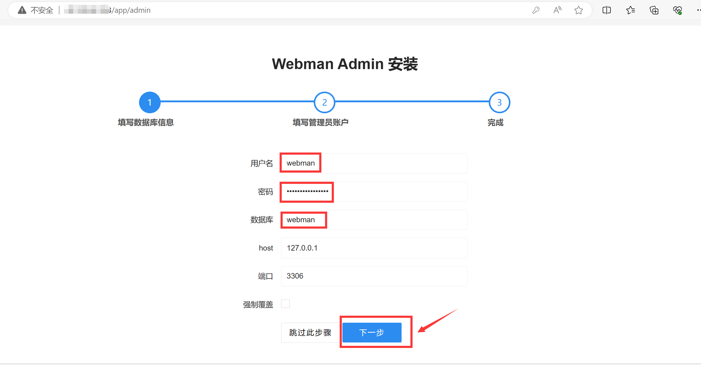

# 宝塔面板安装webman/ai助手

> **提示**
> 本章节为宝塔环境安装，命令行安装请参考[命令行安装](base.md)

## 环境要求
宝塔里选择安装 nginx mysql>=5.5 php>=7.4，安装过程省略

## 安装步骤

1. 给PHP安装fileinfo redis扩展
  

2. 打开终端
  

3. 切换到root用户，解除函数禁用
```shell
sudo su
curl -Ss https://www.workerman.net/webman/fix-disable-functions | php
```
   

4. 在 /www/wwwroot/ 下创建webman目录
```shell
cd /www/wwwroot/
composer create-project workerman/webman
````
  

5. 进入到webman目录安装 webman-admin 及其它所需组件
```shell
cd webman
composer require -W webman/admin webman/openai
```
  

6. 启动webman
```shell
php start.php restart -d
```

  

7. 设置站点
   

  > **注意**
  > 站点目录选择 /www/wwwroot/webman/public

8. 配置站点
   

9. 伪静态配置
   
```
proxy_buffering off;
location ^~ / {
  proxy_set_header X-Real-IP $remote_addr;
  proxy_set_header Host $host;
  proxy_set_header X-Forwarded-Proto $scheme;
  proxy_http_version 1.1;
  proxy_set_header Connection "";
  if (!-f $request_filename){
      proxy_pass http://127.0.0.1:8787;
  }
}
```

10. 创建数据库

  
  记住数据库、用户名、密码，下一步要用到

11. 进入webman/admin安装向导

  访问 `http://域名.com/app/admin` 填写数据库、用户名、密码，完成webman/admin的安装
  

12. 进入webman/admin后台安装`用户模块`和`webman AI助手`

  

  > **注意**
  > 基础版用户请安装 webman AI助手基础版

13. 新增apikey

   

14. 至此webman/ai助手基本安装完毕

   plus版本访问地址 `http://域名.com/app/ai`  
   基础版本访问地址 `http://域名.com/app/gpt`  

其它部分设置请参考后续章节