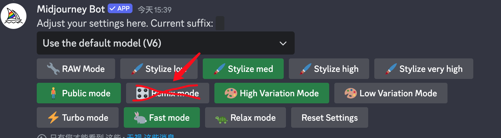
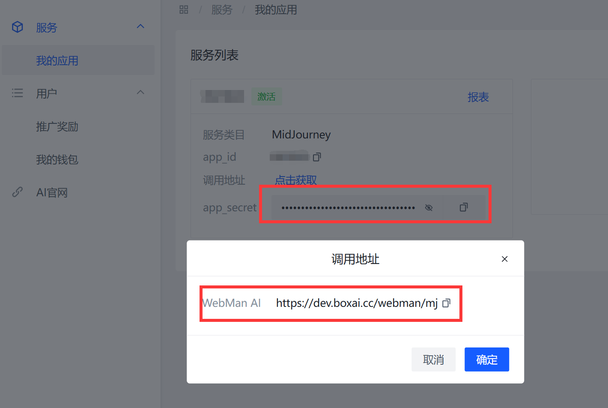
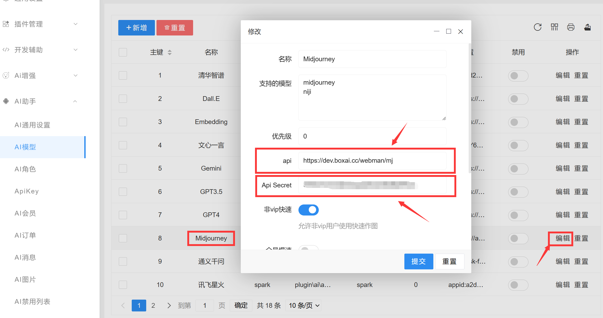

# Midjourney设置

> **注意**
> webman ai基础版不支持绘图功能

# 使用Midjourney的两种方案
方案一：自己注册并订阅MidJourney，需要开发者有能力登录discord并且有信用卡  
方案二：使用MidJourney代理商的接口，推荐 [https://dev.boxai.cc](https://dev.boxai.cc/share/17) ，联系QQ 946599101  

## 方案一：自己订阅MidJourney教程如下

**使用前提**
注册并订阅 MidJourney，**一定要创建自己的服务器和频道**，获取guild-id、channel-id、token、useragent [参考文档](https://www.workerman.net/a/1654)

**安装webman/midjourney**

```shell
composer require webman/midjourney
```

**设置**
打开webman目录下`config/plugin/webman/midjourney/process.php` `accounts` 和 `proxy`设置如下
```
'accounts' => [
    [
        'enable' => true,
        'token' => '上一步token实际值',
        'guild_id' => '上一步guild-id实际值',
        'channel_id' => '上一步channel-id实际值',
        'useragent' => '上一步user-agent实际值',
        'concurrency' => 3, // 并发数， 10/30刀账户填3，60/120刀填12
        'timeoutMinutes' => 10, // 任务提交mj后10分钟未响应则认为超时
    ]
],
'proxy' => [
    'server' => 'https://dis.imgin.top', // 海外用 https://discord.com
    'cdn' => 'https://cdn.imgin.top', // 海外用 https://cdn.discordapp.com
    'gateway' => 'wss://ws.imgin.top', // 海外用 wss://gateway.discord.gg
    'upload' => 'https://upload.imgin.top', // 海外用 https://discord-attachments-uploads-prd.storage.googleapis.com
],
```

设置完毕后一定要执行 `php start.php restart -d` 重启(reload不生效)

> **注意**
> webman/midjourney不支持 remix 模式，discord里不要开启 `remix mode` 模式 (默认不开启，不用做任何处理)




## 方案二




如图所示，将api地址和密钥填写到 webman-admin后台->AI模型->Midjourney 里，并保存


